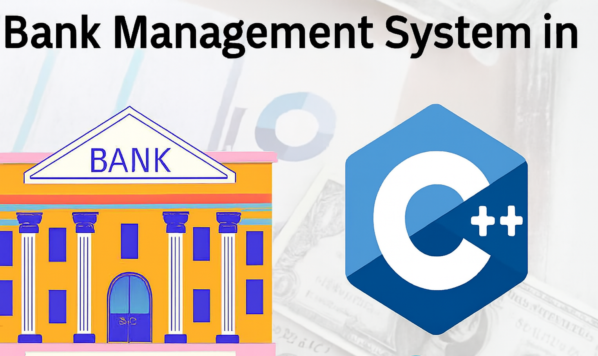

# **(OOBS)** -> Object Oriented Banking System.

***
 project cover, project logo">

## 💡 The Idea.
    Making C++ CLI Application simulate BMS (Bank Management System) with two Applications (Bank Application, ATM Application) with their functionalities. continue reading.

## 🔑 Requirments to run App.
1. windos OS.
2. g++ Comiler.
3. available Bash terminal.

## ▶ How to run.

1. clone this repo to your device.
2. make sure you are in main folder "OOBS-Object_Oriented_Bank_System".
3. open your terminal in this folder path.
4. use this command `cd build` to go to build folder.
5. use this command `run.sh` to run the file that compile app and run it.
6. once you do that you found "**main.exe**" file escute it.
7. Finally 🎉, it's work;
9. use this demo username and password to login `username: admin`, `password: 1234`
8. explore it by your self .

##
